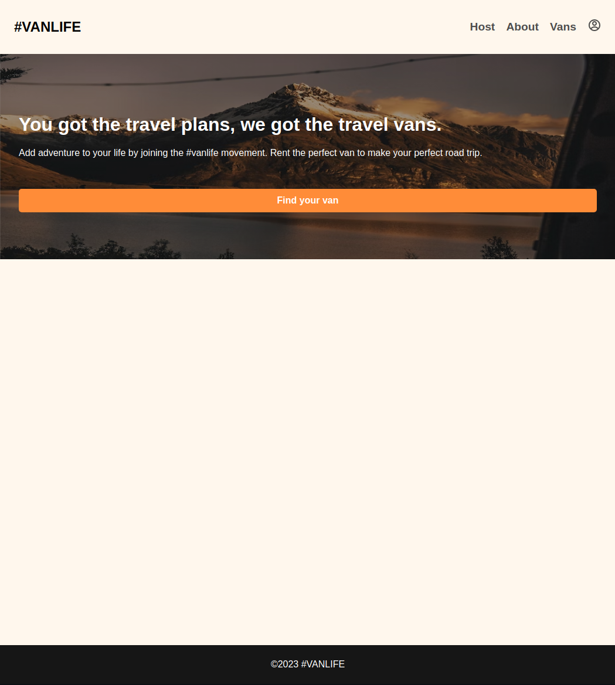
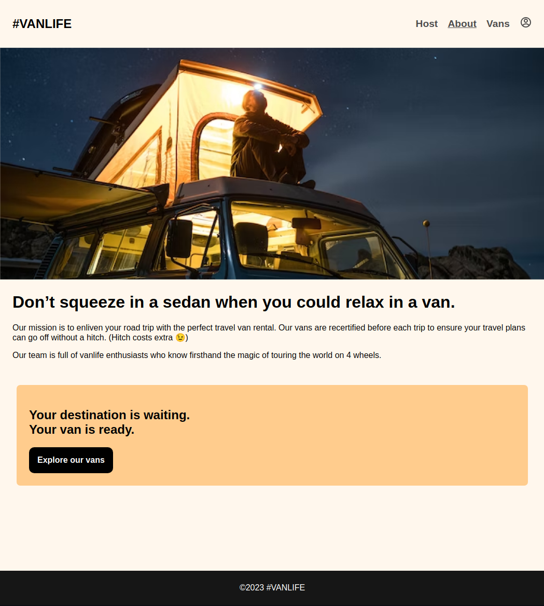
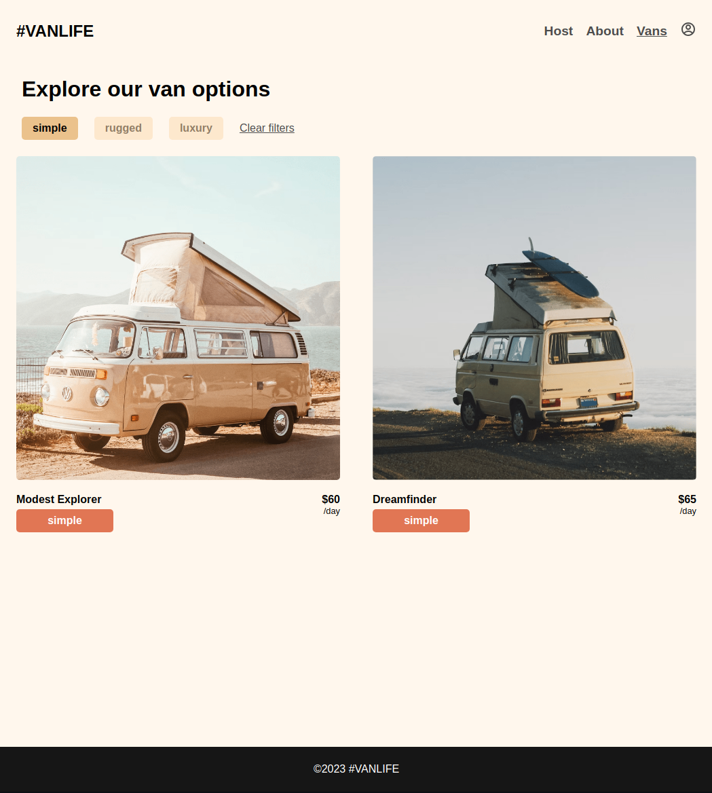
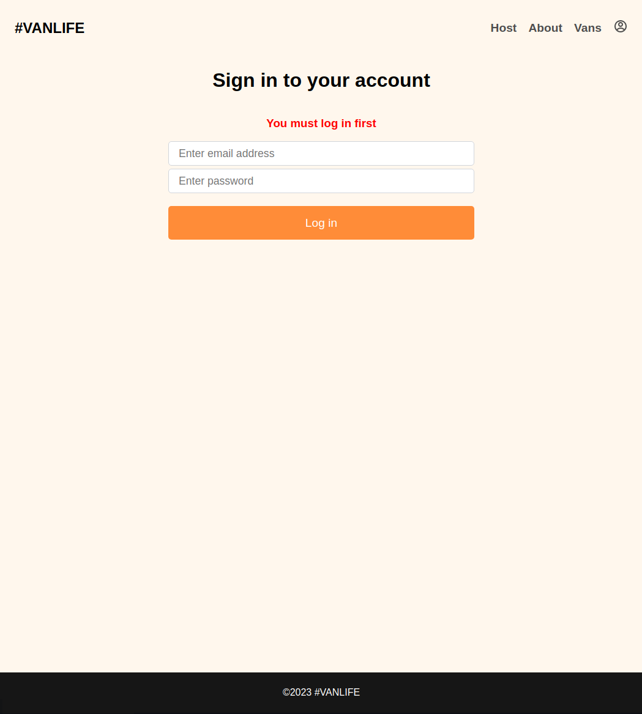
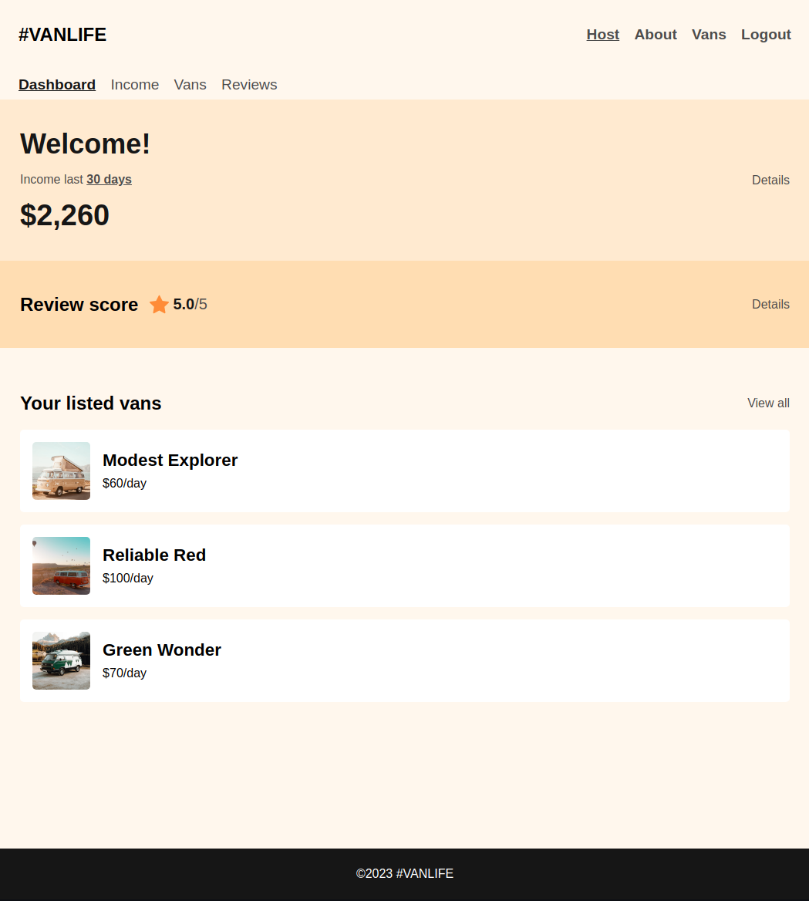
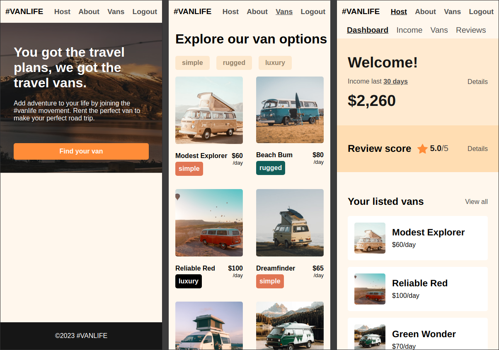
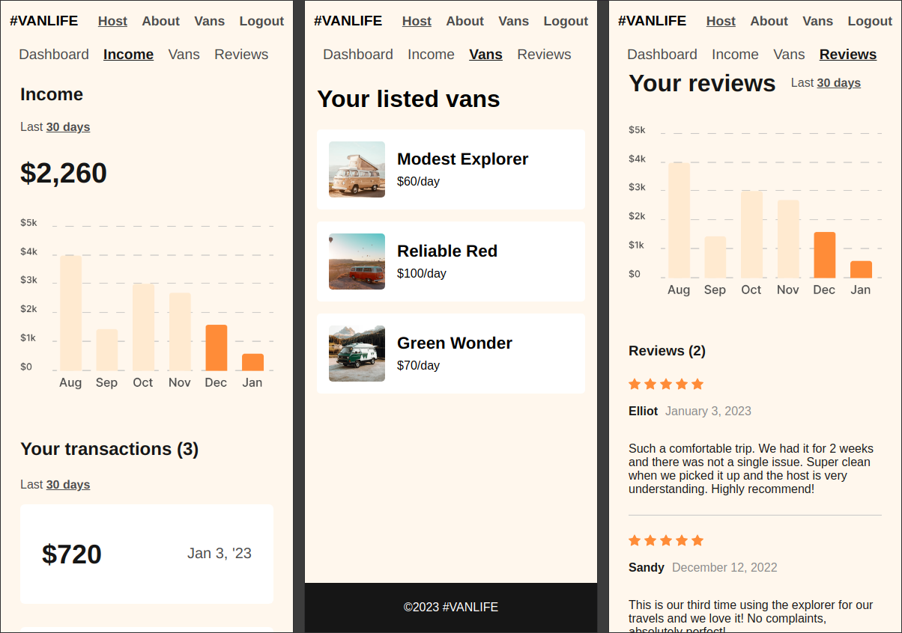

# Scrimba React (Router) Project #9: Van Rental App

The goal of this Scrimba course was to create a van rental app using React Router. I did almost all of the challenges and CSS styling on my own (except for static Dashboard, Reviews and Income pages which were provided in the course). Additionally I replaced mock Mirage JS authentication with Firebase, although it's not the best implementation since onAuthStateChanged method is repeated twice as a workaround. Firebase functionalities are limited to fetching hardcoded data and authentication since it wasn't the primary focus of the course.

If I were to implement the project from scratch, I'd get rid of loaders and use context to provide auth / firebase related functions and user state to components that need them. A protected route component would check if the user is logged in before redirecting to the relevant page (and redirect to the login page if not).

I started this project in late June 2023 and finished it in July 2023.

## Assignment

[Scrimba - Learn React Router - #9 Van Rental App](https://scrimba.com/learn/reactrouter6)

[This course is also available on YouTube](https://www.youtube.com/watch?v=nDGA3km5He4)

## Technology

- React
- React Router v6
- JavaScript
- Firebase (Firestore & Authentication)
- CSS
- Vite

## Key Concepts

Introduction:
- Multi-page and single-page apps
- BrowserRouter & Routes
- Route, path & element
- Link
- Mock Mirage JS server
- Route Params: useParams()

Nested Routes:
- Layout Route & Outlet
- Relative Paths & Links
- Index Routes
- NavLink & Active Styling
- Outlet Context: context & useOutletContext()

Search Params & Links:
- Query Parameters
- useSearchParams() & filtering the array with the setter function
- Link state & useLocation()
- Error handling & 404 page

Loaders & Errors:
- loader & useLoaderData()
- createBrowserRouter(), createRoutesFromElements() & RouterProvider
- errorElement & useRouteError: handling errors

Actions & Protected Routes:
- Protected Routes: with loaders & without
- AuthRequired Layout Route & Conditional sending to /login page
- Navigate, redirect & useNavigate()
- action function: useActionData(), Form component, FormData interface & request object
- useNavigation(): state

Deferred Data:
- Promises & defer()
- Await & resolve
- Suspense & fallback

Firebase:
- Authentication
- Firestore database

## Features

- Login to access the host nested route
- Fetch data from Firestore
- Show a message the the user must be logged in to access the host route
- Send user to the previous protected path after logging in
- Remove the login page from the history stack after logging in
- Conditional rednering of login and logout links in the Header component

## Test account

- email: test@test.com
- password: 123456

## Links

[Live Demo](https://brightneon7631.github.io/scrimba-van-rental-app/)

[My Other Projects](https://brightneon7631.github.io/odin-scrimba-projects/)

## Screenshots

### Desktop











### Mobile





## Deployment

```bash
# clone repo
git clone

# install project dependencies
npm install

# run vite dev server
npm run dev

# create a production build
npm run build
```
